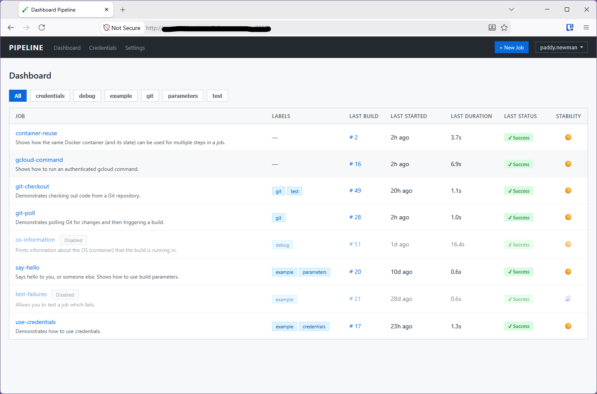
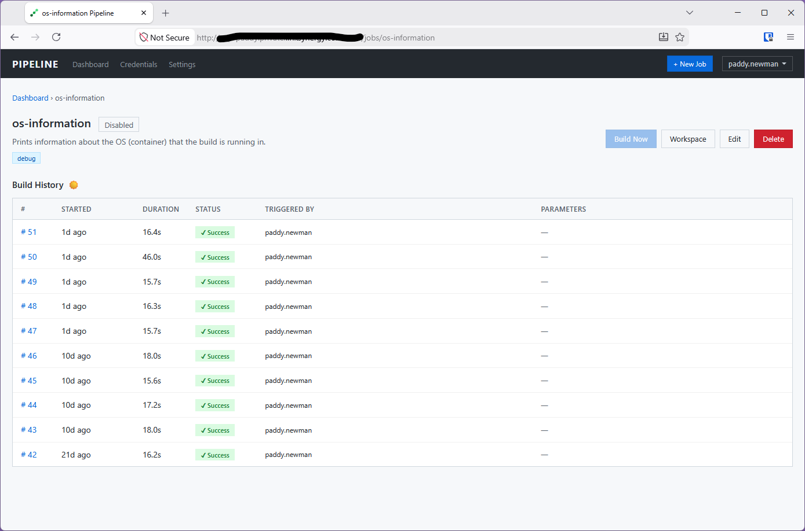
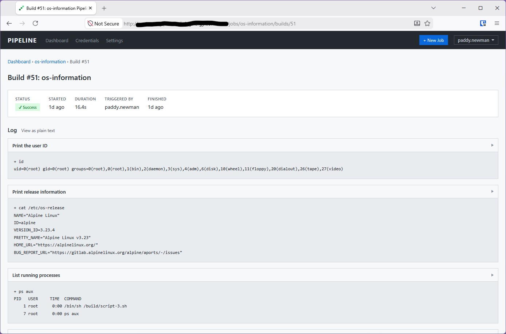

# Pipeline

A vibe-coded, pure-Python automation server, in the style of Jenkins, using
only Python's standard library, a local Docker server and Git.

This is not meant to be used in anger. It's a working demonstration that's
intented to facilitate discussions about using AI to write code.

## Getting started

### Running a test server

You can run the Pipeline server with your own user account from your home
directory.

Install Git and Docker on a Linux host.

Clone the Git repository and then run the server:

    $ ./start-pipeline
    Pipeline listening on http://0.0.0.0:8080

Make sure you start Pipeline as a user that has access to run Docker commands.

All configuration and data is stored under the ./data directory.

### Install using the Makefile

Alternatively, there's a Makefile with an install and uninstall target, if you
want to install it properly:

    $ make install
    $ make uninstall

This will install Pipeline in /usr/libexec/pipeline and data will be stored in
/usr/share/pipeline. You can change these locations easily in the Makefile.

## Features

- Requires only the Python standard library, Docker and Git.
- All configuration and data is stored on the local filesystem.
- Log in, create and manage user accounts.
- Simple role-based access controls (administrators, users and viewers).
- Create jobs based on simple scripted steps.
- Scripted steps run in ephemeral Docker containers.
- Re-use a container (and its state) in multiple steps.
  - E.g., install a package in step one, use it in step two.
  - E.g., authenticate gcloud in step one, use it in step two.
- Access the local Docker server from scripted steps.
  - Allows you to build Docker images.
- Configure job parameters with regular expression validation.
- Configure credentials and use them in jobs.
- Trigger jobs manually or with a cron-style schedule.
- Re-run prevous builds of a job.
- Checkout Git repositories.
- Poll Git repositories for changes and trigger builds.
- Live log updates for long-running jobs.
- View or download files created by jobs.
- Automatically remove old builds of a job.
- Organise and filter jobs using labels.
- Get weather reports indicating job stability.
- Get email notifications when jobs fail.

## Screenshots

The main dashboard:

Viewing a job's details and build history:

Viewing a build and its logs:

